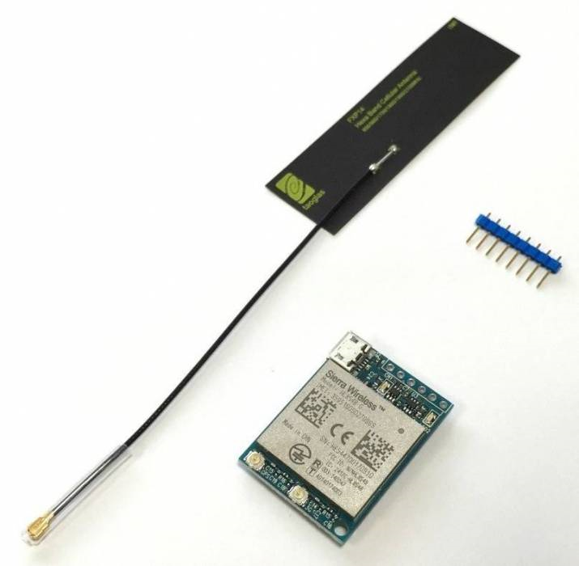
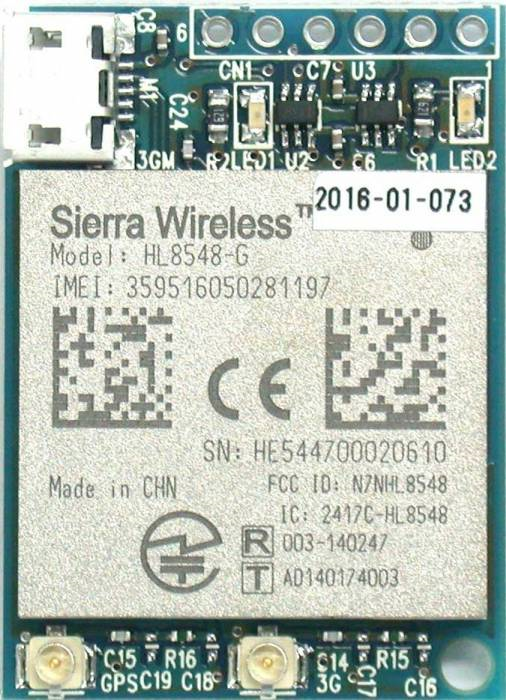
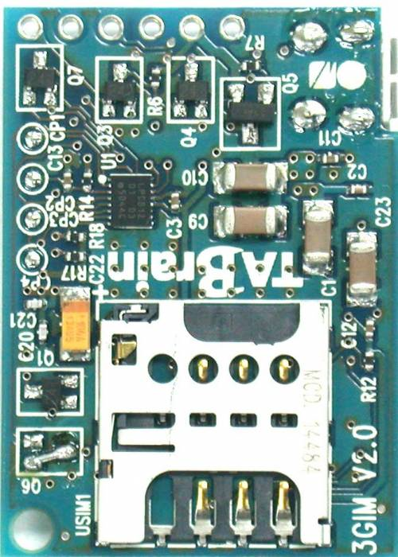
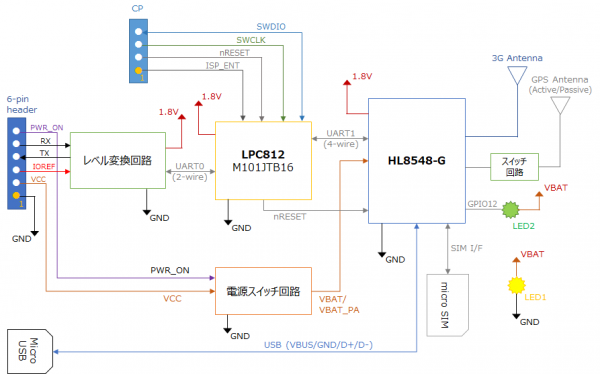
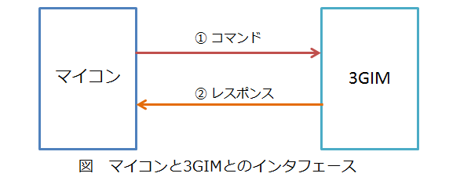

# 3GIM(3G IoT Module) Ver2.2 について

## 概要
**3GIM(V2.2)**は、様々なマイコンを使って、簡単にインターネット接続することができるSDカードサイズの**小型3G通信モジュール**です。ArduinoやRaspberry Pi、mbed等の様々なマイコンで簡単に利用することができます。

Ver2では、コアとなる通信モジュールとしてシエラワイヤレス製の**HL8548-G**を採用し、従来の  [[3gim_v2|3GIM(3G IoT Module) Ver2.x について]] とほぼ互換性を保ちつつ、下記の新しい機能を追加しました。

  * **アクティブGPSアンテナのサポート**
    * ケーブルの長いGPSアンテナを利用することができます
    * GPSの電波が入りづらい場所でも、測位できる可能性が高くなります
  * **測位時の最大待ち時間を変更可能に**
    * 従来は3分固定であった最大待ち時間を、3分以内に変更できます。
  * **TCP/IPのネットワークエラー時のタイムアウト時間を変更可能に**
    * $TC/$TR/$TW/$TT等のTCP/IP関連機能で、ネットワークエラー発生時のタイムアウト時間を、60秒以内に変更できます

　※2021年現在、国内では3Gネットワークのカバーエリアが徐々に縮小されています。今後、製品での採用を検討されている方は、**4GIM** または **MGIM** の採用を推奨いたします。

## 外観

3GIM(V2.2)の画像を掲載します。
なお、基板の色やレイアウト・寸法等は、今後変更となる場合がありますのでご注意ください。


### 全体
  * 左から3Gフレキアンテナ、3GIM(V2.2)本体、6ピンヘッダです。



### 表面
  * 右上の6穴(2.54mmピッチ)でマイコンと接続します。



### 裏面
  * マイクロSIMを利用します。




## 提供する機能

3GIM(V2.2)は、従来の3GIM(V2/V2.1)とほぼ互換である下記機能を提供します：
  * 3Gを介したTCPおよびHTTP/HTTPS機能((対応できるSSL証明書には一部制約があります。すべてのサーバに対してHTTPS通信ができることを保証する訳ではありません))
  * 時刻取得
  * GPSを使った位置情報の取得(アクティブGPSアンテナを利用できます)
  * 省電力の制御
  * その他機能(電波強度の取得、ボーレートの変更、APNの切り替え等((利用可能なSIMカードについては、「利用上の留意点」をご覧ください)))

3GIM(V2.1)と同様に、SMS機能(ショートメッセージ機能)は提供しませんので、ご注意ください。

## 3GIMのスペック

| 項目 | 仕様 | 補足 |
| --- | --- | --- |
|外形寸法|幅25mm * 奥行35mm * 高さ7mm|取付穴は2.6mm径(1ヶ所)|
|電源電圧|3.3～4.2V|安定した3.3～4VのDC電源または3.7Vリチウムポリマ電池を推奨(5Vの供給は不可)|
|消費電流|10(sleep時)～900mA(peak時)|利用状況や電波状態に依存|
|3G対応バンド|UMTS(Band1/6/19)|docomoのIOT取得済|
|GNSS|GPS/GLONASS|NMEA準拠。AGPS利用可能。パッシブおよびアクティブGPSアンテナが利用可能|
|マイコンとのインタフェース|UARTを介したコマンド・レスポンス方式 または USBモデム|仕様書は別途公開|
|添付アンテナ|同梱するフレキシブルアンテナ|シールとしてケース等に貼付可|
|ロジック電圧|任意のロジック電圧で利用可能(3GIMにIO電圧を供給)||
|UART|デフォルト設定は9600bps(最大115200bps)/8データビット/パリティなし/1ストップビット|ボーレートは変更可|
|USB 2.0|ATコマンドを利用可能|
|対応SIMカード|microSIM/miniSIM|通常サイズのSIMカードは利用不可。利用実績のあるSIMカードは[[sim|こちら]]|
|添付品|3GIM本体1個、フレキアンテナ1個、8ピンヘッダ1個|GPSをご利用される場合は、別売のGPS用フレキアンテナまたはアクティブGPSアンテナ等をご購入ください|

## ピン配置

3GIMは下表に示す6つのピンでマイコンと接続します。

| ピン番号 | 名称 | 機能など |
| --- | --- | --- |
|1|PWR_ON|電源のON/OFF制御(開放または0でON、1でOFF)|
|2|RX|UARTインタフェース(RX)|
|3|TX|UARTインタフェース(TX)|
|4|IOREF|PWR_ON,RX,TXのロジック電圧|
|5|VCC|電源|
|6|GND|グラウンド|

## ブロック構成図
3GIM(V2.2)の内部ブロック図を下記に示す：



## 機能一覧(UART経由で利用する場合)

### UARTコマンドインタフェースの概要

  * 3GIMは、UART経由で外部(マイコン側)からコマンドを送受信することで利用できます。
  * すべてのインタフェースは、マイコン側からのコマンド送信を契機とします。結果はレスポンスとして、3GIMからマイコン側へ送信されます。
  * コマンドおよびレスポンスは、必ず改行コード('\n')で終端します。
  * すべてのコマンドは、一つのシーケンス（送信と受信のやり取り）で完結します。ただし、 TCPでデータを直接書き込む時（$TTコマンド）は上記の例外で、データを複数回に分けてマイコン側から3GIMへ送ることができます。所定のバイト数のデータを送り終わったときに、3GIM側からレスポンスがあります。



  * 起動直後の出力について
　　　3GIMに電源を供給してONにした後、約14秒後に下記の1行のメッセージが出力されます：
```
 Welcome to 3GIM(V2.2)
```
　　　このメッセージにより3GIMが利用可能になったことを検知することが可能ですが、
　　　通常の処理では一定時間（約14秒間）を待つことで、この出力を無視すること(読み捨てること)もできます。

## 機能一覧

下表に提供機能の一覧を示します。

| 分類 | 機能名 | 機能概要 | コマンド名 | 備考 |
| --- | --- | --- | --- | --- |
|System|バージョンの取得|3GIMに搭載されているファームウェアのバージョン情報を取得する|$YV| |
| |電波受信強度(RSSI)の取得|現在の3Gの電波強度(単位はdBm)を取得する|$YR| |
| |利用可能サービスの取得|現在のSIMカードで利用可能なサービス(無効/パケット通信可)を取得する|$YS| |
| |IMEIの取得|端末固有の識別番号(IMEI:International Mobile Equipment Identity)を取得する|$YI| |
| |LEDの状態の取得・設定|LEDの現在の状態の取得あるいは設定する|$YL|LEDは基板上にLED1と表記された緑色のLED|
| |UART通信速度の変更|UARTの通信速度を(4800/9600/19200/38400/57600/115200bps)変更する|$YB|実行後ただちに有効となる|
| |3GIMのリセット|3GIMをソフトリセットする|$YE| |
| |現在の日時の取得|現在の年月日、時分秒を取得する|$YT| |
| |エアプレーンモードの切り替え|エアプレーンモードの現在の状態の取得あるいは設定する|$YP|エアプレーンモードにすると消費電力を大きく節減可|
| |ATコマンドパススルーモード|ATコマンドパススルーモードに入り、ATコマンドを実行する|$YA|指定された時間経過後に通常モードに戻ることができる|
|Web|GETリクエスト送信・レスポンス取得|HTTP/HTTPSのGETメソッドを送信して、レスポンスを取得する|$WG|DNS使用可。ヘッダ、URL、レスポンスには最大長の制限有|
| |POSTリクエスト送信・レスポンス取得|HTTP/HTTPSのPOSTメソッドを送信して、レスポンスを取得する|$WP|同上|
|TCP/IP|TCP/IPコネクションの接続|TCP/IPコネクションを接続する|$TC|DNS使用可。一度に一つのコネクションのみ|
| |TCP/IPコネクションの切断|TCP/IPコネクションを切断する|$TD| |
| |TCP/IPコネクションからのデータ読み出し|TCP/IPコネクションから指定された長さまでデータを読み出す|$TR|ノンブロッキング方式。バイナリデータも取扱可 1.|
| |TCP/IPコネクションへのデータの書き込み|TCP/IPコネクションへデータを書き込む|$TW|ノンブロッキング方式。バイナリデータも取扱可|
| |TCP/IPコネクションへのデータの直接書き込み|TCP/IPコネクションへデータを直接書き込む|$TT|バイナリデータもそのままで取扱可。最大32000バイトまでを一気に書き込み可|
| |TCP/IPコネクションの状態の取得・設定|TCP/IPコネクションの状態を取得する|$TS| |
| |自ソケットのIPアドレス・ポート番号の取得|自ソケットのIPアドレスを取得する|$TN| |
| |タイムアウト時間の取得・設定|TCP/IPのタイムアウト時間を取得・設定する|$TX| |
|GPS|位置情報の取得|現在の位置情報をGPSを使って取得する|$LG|GPS用アンテナの装着が必要 2.|
| |タイムアウト時間の取得・設定|位置情報取得のタイムアウト時間を取得・設定する|$LX| |
|Profile|デフォルトプロファイルの取得・設定|使用するプロファイル(APN)を設定する|$PS||
### 補足

  - 一部のデータではエスケープ処理($文字を使用)が必要となる。
  - AGPS機能を利用する方法は [[agps_usage|こちら]] を、アクティブGPSアンテナを使用する方法は [[active_gps_usage|こちら]] を参照ください。
  - 上記コマンドの詳細は、ダウンロードページにある「**3GIM(V2.2)のマニュアル**」を参照ください。


## 利用上の留意点
  - docomoのFOMA回線を利用します。そのため、docomoあるいはそのネットワークを利用するMVNOが提供するマイクロSIMが利用できます（ただし、これらの条件を満たす全てのSIMカードでの利用を保証する訳ではありません。利用実績のあるSIMカードは [[sim|こちらのページ]] を参照ください）
  - 3GIMは日本国内でのみ利用できます。海外では各国の法律により現状では利用できません。
  - USBモデムとして利用する場合でも、5番ピンからの電源供給は必要となります。


、## 3GIM、ファームウェア、Arduino用ライブラリの最新バージョンの関係について
最新のバージョンは下記の通りです：

| 3GIMハードウェア | ファームウェア(gw3g) | a3gimライブラリ |
| --- | --- | --- |
|1.0|2.1|R3.1(R4.0以降は使用できません)|
|1.1|2.1|R3.1(同上)|
|2.0|3.1|R4.1|
|2.1|3.2|R4.2|
|2.2|3.3|R4.3|

※上記以外の組み合わせでは動作しないことがありますのでご注意ください。


## 電源について

3GIM(V2)を動作させるためには、最大900mA程度の電流を供給できる3.3～4.2Vの安定した電源が必要です。電圧が中途半端であるため、そのままで使える電源モジュールはあまり市販されていません。Arduinoで利用される場合は、[3GIMシールド(V2) for Arduino](https://www.switch-science.com/catalog/2984/) を利用されるのも一つの方法です。

## トラブルシューティング

[トラブルシューティング](docs/xgim_troubleshooting.md) を参照ください。


## ラズベリーパイで使用する方法

[3GIM(V2)をラズパイで使用する](../4gim/docs/3gim_raspi.md) にて、3GIM(V2)をラズパイで使用する方法を掲載しています。4GIM(V1)を使用する場合も方法は同じです。

## 消費電流について

3GIM(V2)の消費電流をいくつかの状態で測定しました。
[ここ](docs/3gim_v2_cc.md) で公開しますので、参考値としてご利用ください。なおアクティブGPSアンテナを使用する場合は、ここで公開した参考値に加えて、アンテナが消費する電流値をGPS使用時に限り足してください。


## ダウンロード


  * 3GIM(V2.2) 回路図
    * [3gim schematic](docs/3gim_v22_sch.pdf)

  * 3GIM(V1) 用 Arduinoライブラリ
    * [3GIM library for Arduino](https://github.com/openwireless/3gim)

## 購入方法

* スイッチサイエンス様で購入できます
  * [3GIM V.2.2 (フレキアンテナ付き)](https://www.switch-science.com/catalog/3432/)


## 事例

3GIMを使った製作事例です。

  * [Handy Location Notifier(手のひらサイズの位置通知装置)](docs/3gim_sample1.md)
