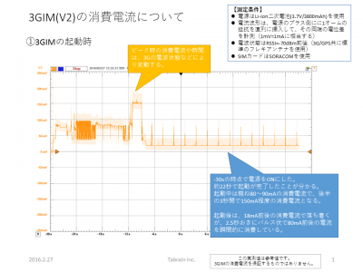
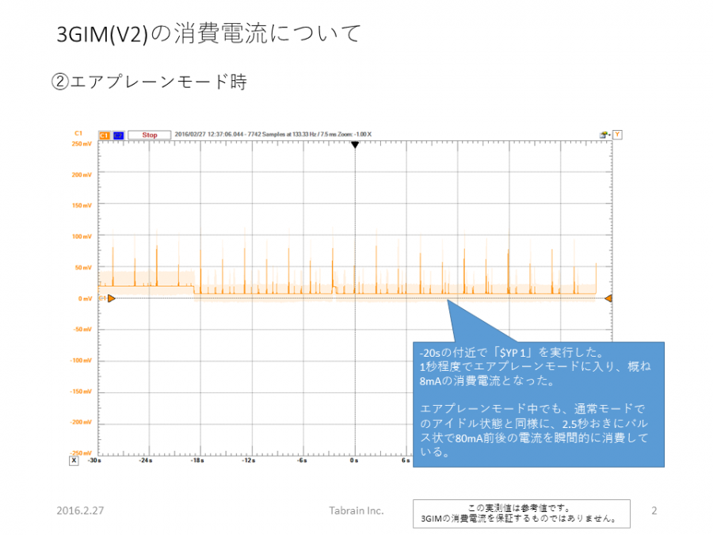
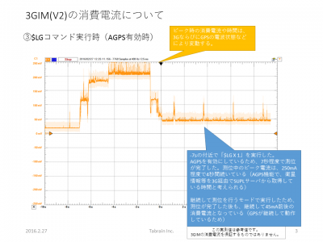
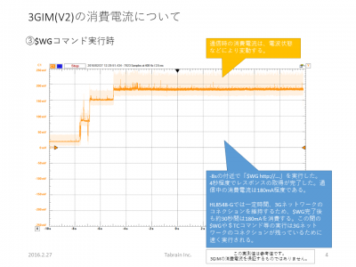

## 3GIM(V2)の消費電流について

いくつかの状態で、3GIM(V2.2)の消費電流を測定しました。参考値として参照ください。

  * 3GIM起動時

  * Airplaneモード時

  * $LG実行時(AGPS使用時)

  * $WG実行時(3G通信時)

  * 電源OFF時
　PWR_ONピンをHIGHにすることで3GIMをOFFにできますが、この時のVCCの消費電流(漏れ電流)は約**0.6mA**です。この値は、VCCの電圧や温度環境などにより変わります。
