# IoTAB (Ver1)について

## 概要

**IoTAB**(IoT Arduino Board)は、3GIM/4GIMと組み合わせて利用することができる**Arduino Zero互換**の小型マイコンボードです。
MCU(32-bit ARM Cortex-M0+)に加えて、3軸加速度センサ、温度センサ、リチウムポリマ電池の充電回路を搭載しています。**低消費電力**を考慮した設計であるため、**電池で駆動するようなIoTデバイス**を簡単に開発することができます。
ボードのフットプリント(占有サイズ)は3GIM/4GIMと同じ25mm*35mmと小型です。3GIM/4GIMと重ね合わせることで、コンパクトなIoTデバイスを作ることができます。

## 外観

IoTAB(V1)のサイズは 25mm*35mm*7mm(電池コネクタを含む)、重さは約2.6gです。
IoTAB(V1)の外観写真を下記に示します。なお、基板の色やレイアウト・寸法等は、今後変更となる場合がありますのでご注意ください。

### 表面
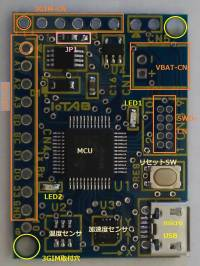

### 裏面
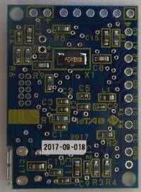

### 3GIMと組み合わせた場合(1)
IoTABと3GIMを重ね合わせて、6ピンヘッダを半田付けしています。

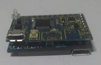

### 3GIMと組み合わせた場合(2)
IoTABと3GIMの間には、高さ3mmの白いスペーサを入れて、径2mm/長さ10mmのプラねじとナットで留めています。

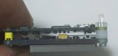

### 3GIMと組み合わせた場合(3)
重ね合わせた時の高さは約11mmとなります。フットプリントがほぼ同一(25mm*35mm)である容量400mAhのリチウムポリマ電池を重ねると、全体の高さは約15mmに収まるサイズとなり、薄手の小型ケースにも収容できます。

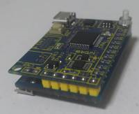

## 機能概要
IoTAB(V1)は、下記の機能を提供します。

  * Arduino Zero/m0 互換のマイコン機能（超低消費電力でRTCを内蔵、Arduino IDEで開発可能）
  * 低消費電力で高精度な3軸MEMS加速度センサを搭載
  * 低消費電力なデジタル温度センサを搭載
  * リチウムポリマ電池の充電機能（マイクロUSBコネクタから充電）
  * 外部インタフェースとして、I2C*1,UART*1,ADC/GPIO*4(うちDAC*1としても利用可)を提供

余分な機能を持たないコンパクトなマイコンボードですので、3GIM/4GIMと組み合わせることで、IoTゲートウェイやセンサノードとして簡単に利用することができます。
搭載している加速度センサや温度センサ等は、別途公開しているArduino用ライブラリ（iotab, 3gim2, mma8451q, stts751）を使えば簡単に利用することができます。


## IoTABのスペック

| 項目 | 仕様 | 補足 |
| --- | --- | --- |
|外形寸法|幅25mm * 奥行35mm * 高さ3.5mm|3GIM/4GIMと同一サイズ。取付穴は2.6mm径(1ヶ所)|
|電源電圧|3.6～4.2V(リチウムポリマ電池／リチウムイオン電池を推奨) または 4.5～5.5V(USB給電からの充電用)|USBからの給電は充電専用。マイコンや3GIMの動作には3.6～4.2Vの電池の使用が必須|
|消費電流|0.4(standby時)～10.3mA(active時/LED消灯)、外部モジュールへの給電分を除く|利用状況や外部回路に依存|
|PCとのインタフェース|マイクロUSBコネクタ（USBケーブル経由で接続）|仮想COMポートとしてArduino IDEからのスケッチの書き込みやシリアルモニタ等で利用可能|
|マイコン|Microchip ATSAMD21G18 (CPU: 32-bit, Flash:256KB, SRAM:32KB, Clock:48MHz, UART*1/I2C*1, ADC/GPIO*4 10/12-bit, DAC*1 10-bit) |Arduino IDE 1.8以降で開発可能|
|ロジック電圧|3.3V|5Vトレラントではないため注意|
|添付品|IoTAB本体1個、10ピンヘッダ1個、電池用2ピンコネクタ1個||

  - 使用できるリチウム二次電池は、標準電圧が3.7Vの単一セルのリチウム二次電池です。3GIM/4GIMと組み合わせて利用する場合は、過放電保護回路を持ち、電池容量が400mAh以上のリチウムポリマ電池またはリチウムイオン電池を推奨します。これらの電池以外の使用は保証しません。
  - Arduino Zeroと同様に、ADCは最大12-bitの分解能で4チャネルを利用することができます。DACは10-bitの分解能で1チャネルを利用できます。
  - 1pinあたり、最大7mAまでの電流を流すことができます。

## ブロック図

IoTAB(V1)の内部ブロック図を下記に示す：

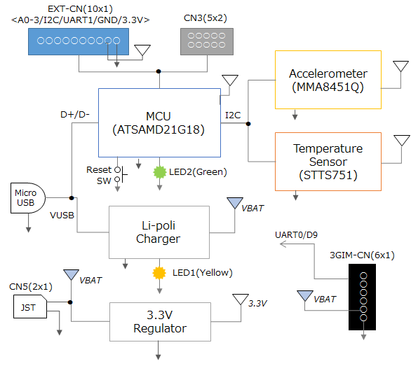

## ピンアサイン

**EXT-CN**のピンアサインを下表に示します。

| ピン番号 | 名称 | 機能説明 | 補足 |
| --- | --- | --- | --- |
|1|A0/DAC|ADC(10/12-bit) or DAC(10-bit)|GPIOとしても利用可能|
|2|A1|ADC(10/12-bit)|GPIOとしても利用可能|
|3|A2|ADC(10/12-bit)|GPIOとしても利用可能|
|4|A3|ADC(10/12-bit)|GPIOとしても利用可能|
|5|SDA|I2CのSDA|ボード上に搭載しているセンサでも利用|
|6|SCL|I2CのSCL|同上|
|7|D1/TX0|D1 or TX0|ArduinoではSerialとして利用可能、GPIOとしても利用可能|
|8|D0/RX0|D0 or RX0|同上|
|9|3.3V|3.3Vの電源出力|最大800mAまで供給可能(ただし、使用するリチウム電池の最大放電電流に依存)|
|10|GND|GND||

  * ADCの分解能を標準の10bitから12bitに変更するには、analogReadResolution()関数を使用します。
  * DACを利用するには、A0ピンに対してanalogWrite()を使用します。

**3GIM-CN**のピンアサインを下表に示します。ピンの並びは3GIM/4GIMと一致しているので、直接3GIM/4GIMを向かい合わせに接続することができます。

| ピン番号 | 機能 | 3GIMとの対応 | 説明 |
| --- | --- | --- | --- |
|1|D9|PWR_ON|3GIM/4GIMの電源を制御する(LOW:ON/HIGH:OFF)|
|2|TX1|RX|Serial1で読み書きする|
|3|RX1|TX|同上|
|4|3V3|IOREF|3.3Vが供給される|
|5|VBAT|VCC|リチウム電池と直接接続される|
|6|GND|GND||

## 機能一覧

| 分類 | 機能名 | 機能概要 | 補足 |
| --- | --- | --- | --- |
|マイコン|マイコン|Arduino Zero互換のATSAMD21G18を採用||
|加速度センサ|加速度計測等|最大分解能14-bit, 最大サンプリング周波数800Hz, FIFO(32サンプル), モーション・フリーフォール検知機能, タップ・ダブルタップ検知機能等|NXPセミコンダクタ社MMA8451Q搭載|
|温度センサ|温度計測|デジタル温度センサ。分解能は9～12-bit、測定精度は±1.0°C(typ) @0°C～+85°C|STMicroelectronics社STTS751|
|Li-poli充電|リチウムポリマ電池充電|リチウムポリマ電池を、USBからの電源を使って最大500mAの電流で充電する。|充電中はLED1が点灯、消灯したら充電完了|
|リセットSW|MCUリセットスイッチ|MCUをリセットする||
|その他|LED2|MCUから点灯/消灯を制御する||

## IoTABの特長と利用例

  - IoTABを使った試作・開発では、**Arduino IDE**を利用できます。お使いのPCとマイクロUSBケーブルでIoTABを接続するだけで簡単に開発できます。
  - 3GIM/4GIMと組み合わせて、**コンパクトなIoTゲートウェイ**として利用できます。外部インタフェースコネクタ(EXT-CN)にUARTが一つありますので、そこにBLEモジュールや独自の小型無線モジュール（モノワイヤレス社のTWELITE等）を接続することができます。これらの近距離通信モジュールで収集したデータを、3GIM/4GIM経由でクラウドサーバに上げることができます。
  - IoTABに搭載しているMCU(**ATSAMD21G18**)は、Arduino Zeroやm0と同じ製品を使っていますので、Zero/m0用として公開されている様々なライブラリやスケッチをそのまま使用することができます。
  - ATSAMD21G18の持つ**RTC(Real Time Clock)**機能を使ってMCU自身をスリープさせることにより、消費電力を非常に少なく抑えることが可能です。スリープ状態からは、RTCのアラーム機能（指定した時刻、毎時15分等の指定が可能）や加速度センサからの割り込み（一定以上の加速度を検知した時など）により瞬時にウェイクアップさせることができます。このような機能を利用すれば、橋梁等の**構造物のモニタリング装置**、3GIMのGPS機能を使って移動時のみ位置を収集・アップロードする**省電力な動態管理端末**などを実現することができます。

## IoTABの利用手順
IoTABをArduino IDE(バージョン1.8以上)で開発するようにするには、以下の手順で設定してください。

　1. Arduino IDEのファイル/環境設定のダイアログで、「追加のボードマネージャのURL」に、下記の行を追加します。
```
    http://tabrain.jp/products/config/package_tabrain_index.json
```


　2. Arduino IDEのツール/ボードで「ボードマネージャ..」を選択します。リストの中にある「IoTAB ARM Board by TABrain」を選択します。

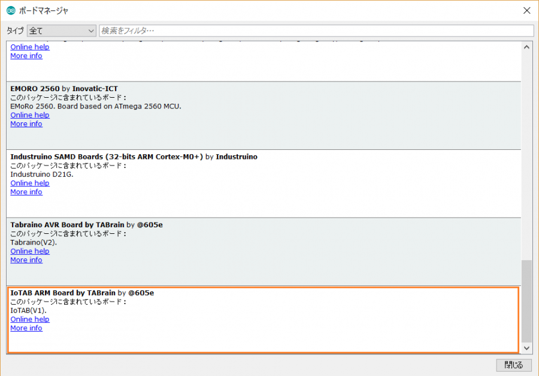

　3. 「IoTAB ARM Board by TABrain」の「インストール」ボタンを押して、IoTABのスケッチのビルドに必要なファイル群をインストールします。

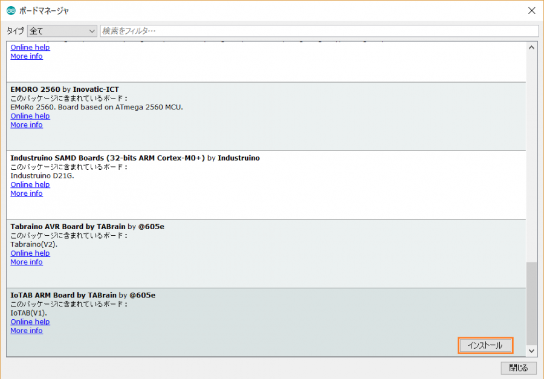

　4. 次に、Arduino Zeroのビルドに必要な「Arduino SAMD Boards (32-bits ARM Cortex-M0+) by Arduino」ボードを同様にインストールします。

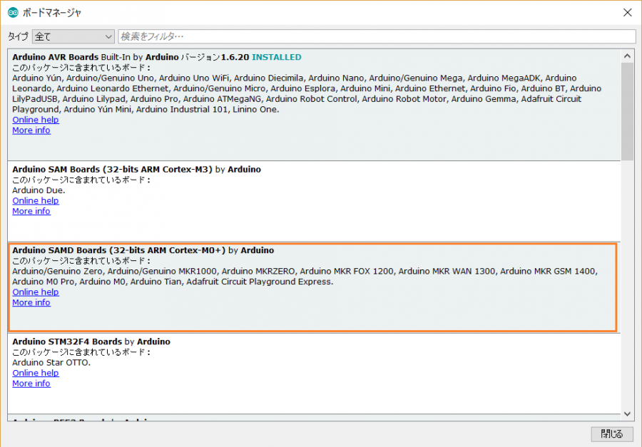

　5. 途中でエラー等が発生せず、上記の手順が正しく実行できたことを確認します。正しくインストールできた場合は、ボード名の横に「INSTALLED」と表示されます。

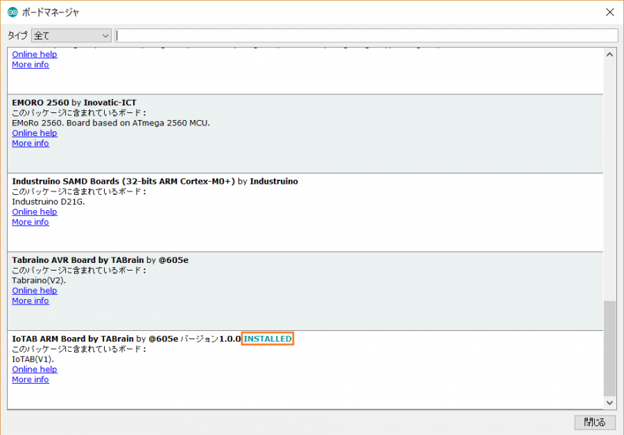

　6. Arduino IDEの「ツール」メニューの「ボード」サブメニューを選択して、ボードの選択肢の中から「IoTAB (V1)」を選択します。

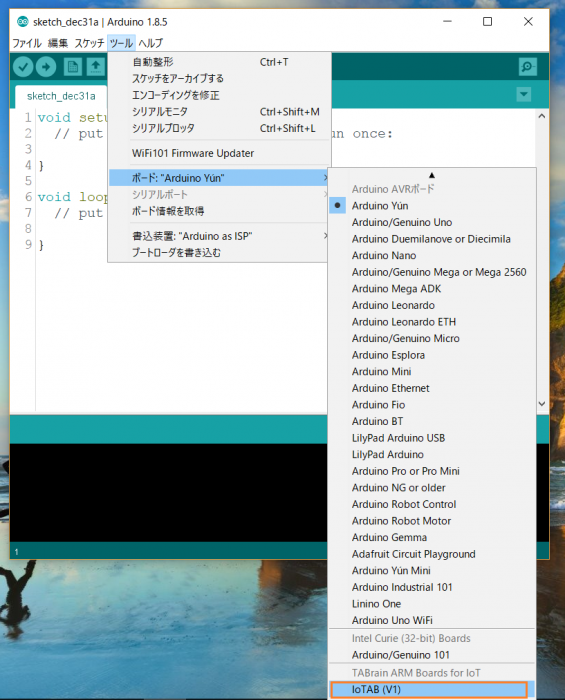

　7. IoTABをUSBケーブルでPCと接続すると、USBドライバのインストールが始まります。USBドライバのインストールが完了したら、デバイスマネージャを開いてデバイスの状態を確認します。USBドライバが正しくインストールできている場合は、「Arduino Zero (COM*)」という名前のCOMデバイスとして認識されます。

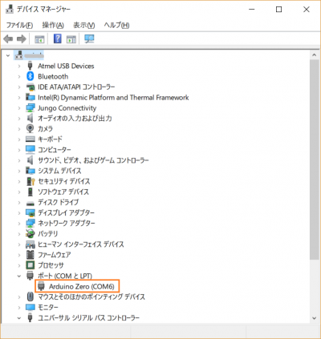

## IoTABを利用するためのリチウム電池について
IoTAB(V1)で利用可能なリチウム電池は、単一セルのリチウムポリマ電池またはリチウムイオン電池です。これら以外のリチウム電池は使用できませんので、十分ご注意ください。
具体的には、下記のURLにある製品を利用することができます（実際に利用実績もあります）。

[リチウムイオンポリマー電池400mAh](https://www.switch-science.com/catalog/3118/)

[リチウムイオン電池900mAh](https://www.switch-science.com/catalog/2073/)

電池の選択の目安として、3GIMを併せて利用するケースでは最大連続出力電流が600mA以上のものを推奨します。

## IoTABの消費電流について
いくつかの利用ケースにおけるIoTABの消費電流の実測値を、下表に示します。
この計測は比較的高精度なマルチテスタを用いて行った数値ですが、あくまでも参考情報としてお取り扱いください。

| # | 測定条件 | 消費電流[mA] | 補足 |
| --- | --- | --- | --- |
|1|delay()関数を実行しているとき|10.02|iotabライブラリのblink_led2でLED2が消灯しているとき|
|2|LED2を点灯しているとき|11.29|iotabライブラリのblink_led2でLED2が点灯しているとき|
|3|RTCでスリープしているとき|1.05|RTCZeroライブラリのstandby()関数を呼んでスリープしているとき|
|4|加速度センサだけをサンプリング周波数12.5Hzで動かし、MCUはスリープしているとき|1.07|一定以上の加速度があればMCUをすぐに起こせる状態|
|5|#4とおなじだが、加速度の精度を8bitに落としているとき|0.91|同上|
|6|I2Cを使わないとき|0.81||
|7|I2Cを使わないときで、3.3Vの電源を3.3Vピンに直接接続したとき|0.43|IoTAB搭載のレギュレータを使用しない|
|8|No.7の条件に加えて、GPIOをすべてINPUT_PULLUPにしたとき|0.38|IoTAB搭載のレギュレータを使用しない場合で、おそらく最も消費電流の少ないケース|

  * 測定環境は、IoTA(V1)、リチウムポリマ電池(400mAh、Sparkfun製)を使用して、室温25℃程度の屋内で測定しました。
  * 電流値の測定は、LILIPUT OWON社のデジタルマルチメータB35を使用しました。スペック上の測定精度は +/-1% 程度です。
  * 3GIM/4GIMをIoTABに接続している場合、D9(PWR_ON)をHIGHにして電源OFFとした状態でも、3GIM/4GIM側で200～300uA程度の電流が消費されますのでご注意ください。
  * MCUに内蔵しているRTCを使ってスリープする例を以下に示します：

```
#include <RTCZero.h>
#include <iotab.h>

RTCZero rtc;

void setup() {
  iotab.begin();
  rtc.begin();

  rtc.setTime(0, 0, 0);
  rtc.setDate(1, 1, 2020);  // 2020年の元旦になったら起きる
  rtc.setAlarmTime(0, 0, 0);
  rtc.enableAlarm(rtc.MATCH_HHMMSS);

  rtc.attachInterrupt(alarmMatch);
  rtc.standbyMode();
}

void loop() {
}

void wakeUp() {
  // 起きた時にすること
}
```

## ダウンロード

  * IoTAB(V1) 回路図
    * [回路図](docs/iotab_v1_sch.pdf)

  * IoTAB(V1) 用Arduinoライブラリ
    * [Github - iotab](https://github.com/openwireless/iotab.git)


## 作例

  * [IoTABを使った作例](docs/iotab_samples.md)
