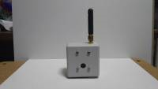
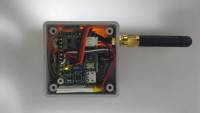

# IoTABを使った作例 - 小型4Gカメラ

IoTAB(V1)を使った小型3G/4Gカメラの作例を紹介します。
このカメラの概要は以下の通りです。
  * サイズが小さく(50*50*25mm)、どこにも簡単に設置できる(3G/4Gを使い、電池で駆動)
  * 使用するセンサやファームウェアをカスタマイズできる(Arduino IDEを使った開発が可能)
  * 小型の二次電池(300mAhのリチウムポリマ電池)を採用し、2時間に1回の撮影で2日間ほど稼働できる

## 主なパーツ構成

|パーツ|型番等|スペック|入手先|補足|
| --- | --- | --- | --- | --- |
|マイコン|IoTAB(V1)|Arduino Zero互換|スイッチサイエンス(近日販売予定)||
|カメラ|小型TTLシリアルJPEGカメラ|解像度VGA、カラー、JPEG形式出力、UART接続|秋月電子||
|通信|3GIM(V2.2)または4GIM(V1)|小型3G/4G通信モジュール|スイッチサイエンス(近日販売予定)|別売りの小型ポールアンテナを使用|
|センサ|SHT31 高精度温湿度センサモジュール|温度：-40℃～+125℃で±0.2℃(@0～90℃)、相対湿度：0%～100%で±2%(@0～90℃)|秋月電子||
|ケース|タカチ製 TW5-3-5G|外寸50*50*25mm(ABS樹脂)|千石電商||
|電池|リチウムポリマ電池|3.7V・300mAh|千石電商||
|その他|カメラの電源制御のための回路の部品|FET・抵抗等|||

## 制作にあたっての注意点

  * このカメラが撮影した写真をアップロードする先のサーバが別途必要となります。AWS等のクラウドサービスを利用して構築する等が必要となります。

## 完成写真
  * 正面から

  * 裏から（蓋を開けたところ）

