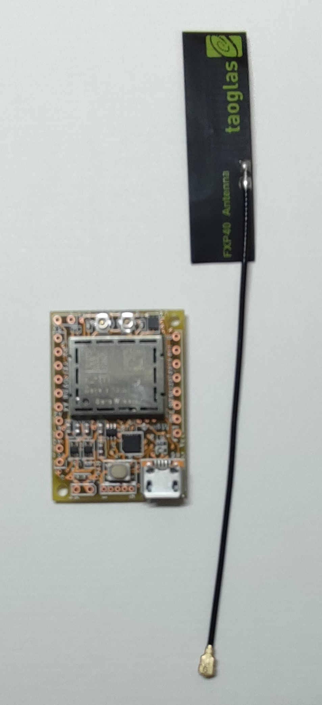
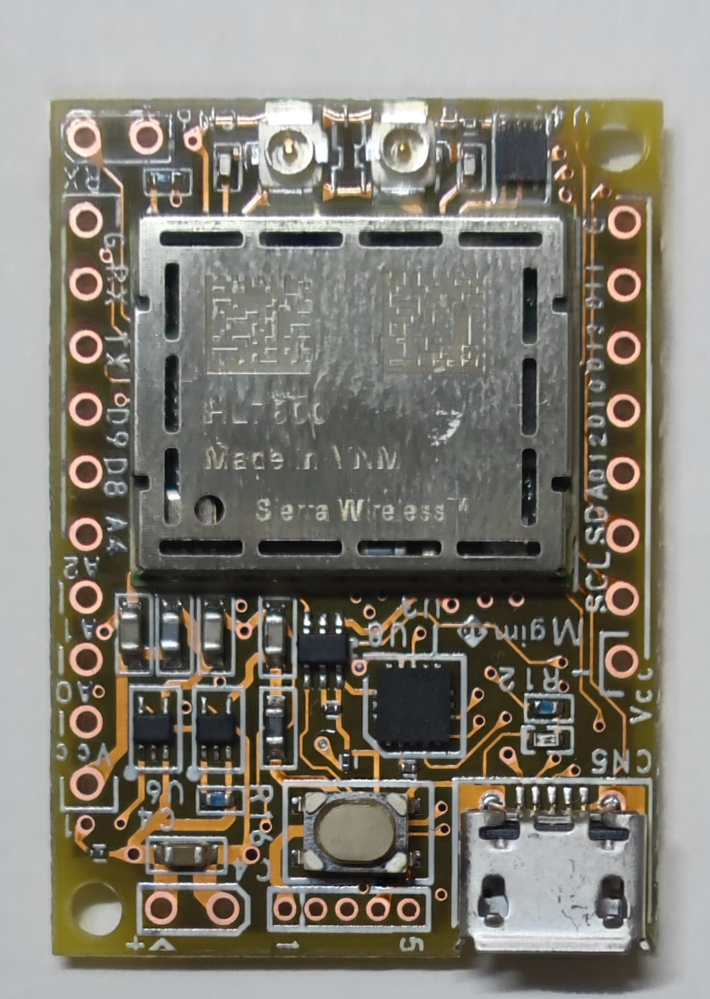
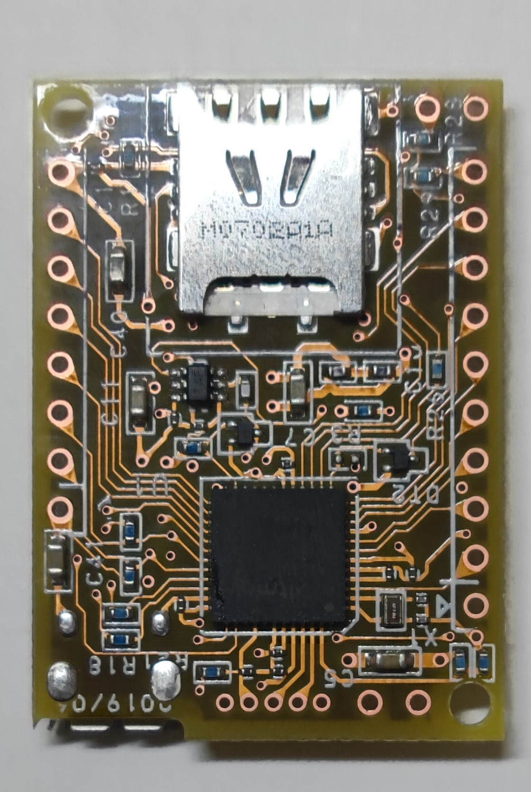
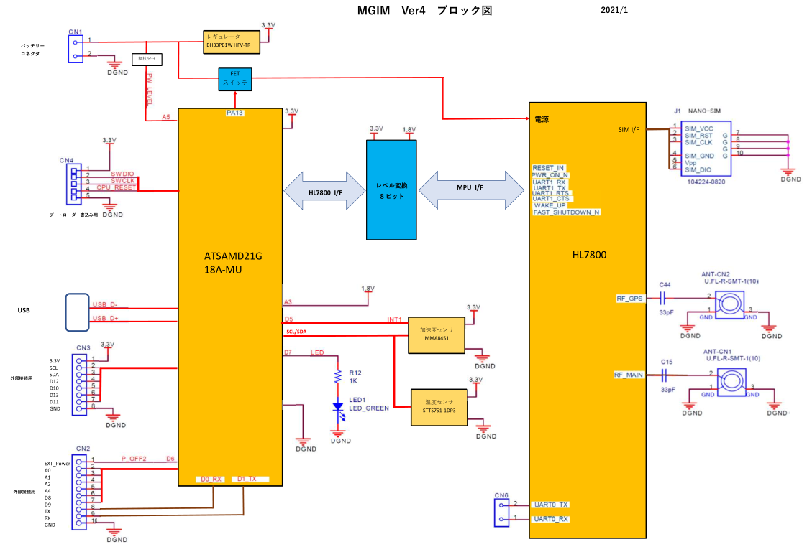

# MGIM Ver4 について

## 概要
**MGIM(エムジム)**は、様々なマイコンを使って、簡単にインターネット接続することができるSDカードサイズの**LTE-M通信モジュール搭載の小型マイコン**です。Arduino Zero互換のマイコンとして、IoTのプロトタイピングや量産試作等にすぐ利用することができます。

MGIM Ver4では、コアとなる通信モジュールとしてシエラワイヤレス製の**HL7800**を採用し、3GIM/4GIM/SGIM と同じサイズの小型マイコンとなっています。

  * LTE Cat.M1(通称 LTE-M)を使用してLPWA通信を行う。
    * Sigfoxよりも広いカバーエリアで利用できる
    * 3GIM/4GIMと同様に、低コストなMVNOのSIM(docomo系)が利用可能できる（すべてのMVNOのSIMカードでの利用を保証するものではありません）
  * GPS機能
    * HL7800が提供するGPS機能を使って、測位が可能である
  * HTTP,HTTPS,TCP,UDP通信が利用できる
    * HTTPS通信では、通信相手のサーバのCA証明書を別途インポートする必要がある
    * HTTP/HTTPSとは別に、TCP(1コネクション)、UDPを利用することができる
  * スリープ機能を利用することで、極低消費電力で駆動できる
      * マイコンのスリープ機能を使った間欠動作を行うことで、電池で年単位の駆動が可能となる（電池の持続時間は間欠動作の間隔、プログラムの処理内容により大きく変動します）

## 外観

MGIM(V4)の画像を掲載します。
なお、基板の色やレイアウト・寸法等は、今後変更となる場合がありますのでご注意ください。

### 全体
  * 左からMGIM(V4)本体、小型LTEフレキアンテナです。

### 基板の表面・裏面
  * LTEアンテナ(必須)とGPSアンテナ(オプション)の2つのアンテナを接続することができます。

### 基板の表面・裏面
  * MicroSIMのコネクタがあります。

## 提供する機能

MGIM(V4)は、4GM(V1)と互換性のある下記の機能を提供します
  * LTE-Mを介したTCP、UDPおよびHTTP/HTTPSの通信機能
  * 時刻取得
  * 位置取得
  * 省電力の制御
  * その他機能(電波強度の取得、ボーレートの変更、APNの切り替え等

また、4GIM(V1)や3GIM(V2.1)と同様に、SMS機能(ショートメッセージ機能)は提供しませんのでご注意ください。

## MGIMのスペック

| 項目 | 仕様 | 補足 |
| --- | --- | --- |
|外形寸法|幅25mm * 奥行35mm * 高さ7mm|3GIMと同一サイズ。取付穴は2.6mm径(1ヶ所)|
|電源電圧|3.5～4.2V|安定した3.5～4VのDC電源または3.7Vリチウムポリマ電池を推奨(5Vの供給は不可)|
|消費電流|0.6(sleep時)～700mA(peak時)|利用状況や電波状態に依存|
|対応バンド|LTE(Band1/3/19)|docomo(Xi)のIOT取得済。Band21には非対応|
|外付けマイコンとのインタフェース|UART||
|添付アンテナ|同梱するフレキシブルアンテナ|シールとして非金属製のケースに貼付可|
|ロジック電圧|3.3V固定||
|USB 2.0|ATSAMD21のUSB機能|
|対応SIMカード|microSIM||
|添付品(予定)|MGIM本体1個、フレキアンテナ1個、20ピンヘッダ1個|GPSアンテナを利用される場合は、別売のGPSアンテナをご購入ください|

## ピン配置

MGIM(V4)は、3つのスルーホール(ピンヘッダ用のCN1,CN2,CN3)を持っています。3GIM/4GIMとはピン互換ではありませんので、ご注意ください。

* CN1 (電源コネクタ)

| ピン番号 | 名称 | 機能など |
| --- | --- | --- |
|1|VBAT|3.5～4.2Vの安定した電源(リチウムポリマ二次電池など)|
|2|GND||

* CN2 (GPIOコネクタ)

| ピン番号 | 名称 | 機能など |
| --- | --- | --- |
|1|D27||
|2|A0||
|3|A1||
|4|A2||
|5|D8||
|6|D8||
|7|D9||
|8|TX|Serial|
|9|RX|Serial|
|10|GND||

* CN3 (電源/I2C等コネクタ)

| ピン番号 | 名称 | 機能など |
| --- | --- | --- |
|1|3.3V|最大200mAまで(外部供給電源にも依存)|
|2|SCL|内部でプルアップ済み(4.7k)|
|3|SDA|同上|
|4|D12|Arduino Coreの一部書き換えにより、SPIとして利用可能|
|5|D10|同上|
|6|D13|同上|
|7|D11|同上|
|8|GND||

## ブロック構成図
MGIM(V4)の内部ブロック図を下記に示す：

## 機能一覧

下表に、Arduino向けMGIM/HL7800ライブラリが提する供機能の一覧を示します。

| 分類 | 機能名 | 機能概要 | コマンド名 | 備考 |
| --- | --- | --- | --- | --- |
|System|バージョンの取得|3GIMに搭載されているファームウェアのバージョン情報を取得する|$YV| |
| |電波受信強度(RSSI)の取得|現在の3Gの電波強度(単位はdBm)を取得する|$YR| |
| |利用可能サービスの取得|現在のSIMカードで利用可能なサービス(無効/パケット通信可)を取得する|$YS| |
| |IMEIの取得|端末固有の識別番号(IMEI:International Mobile Equipment Identity)を取得する|$YI| |
| |LEDの状態の取得・設定|LEDの現在の状態の取得あるいは設定する|$YL|LEDは基板上にLED1と表記された緑色のLED|
| |UART通信速度の変更|UARTの通信速度を(4800/9600/19200/38400/57600/115200bps)変更する|$YB|実行後ただちに有効となる|
| |MGIMのリセット|HL7800をソフトリセットする|$YE| |
| |現在の日時の取得|現在の年月日、時分秒を取得する|$YT| |
| |エアプレーンモードの切り替え|エアプレーンモードの現在の状態の取得あるいは設定する|$YP|エアプレーンモードにすると消費電力を大きく節減可|
| |ATコマンドパススルーモード|ATコマンドパススルーモードに入り、ATコマンドを実行する|$YA|指定された時間経過後に通常モードに戻ることができる|
|Web|GETリクエスト送信・レスポンス取得|HTTP/HTTPSのGETメソッドを送信して、レスポンスを取得する|$WG|DNS使用可。ヘッダ、URL、レスポンスには最大長の制限有|
| |POSTリクエスト送信・レスポンス取得|HTTP/HTTPSのPOSTメソッドを送信して、レスポンスを取得する|$WP|同上|
|TCP/IP|TCP/IPコネクションの接続|TCP/IPコネクションを接続する|$TC|DNS使用可。一度に一つのコネクションのみ|
| |TCP/IPコネクションの切断|TCP/IPコネクションを切断する|$TD| |
| |TCP/IPコネクションからのデータ読み出し|TCP/IPコネクションから指定された長さまでデータを読み出す|$TR|ノンブロッキング方式。バイナリデータも取扱可 1.|
| |TCP/IPコネクションへのデータの書き込み|TCP/IPコネクションへデータを書き込む|$TW|ノンブロッキング方式。バイナリデータも取扱可|
| |TCP/IPコネクションへのデータの直接書き込み|TCP/IPコネクションへデータを直接書き込む|$TT|バイナリデータもそのままで取扱可。最大32000バイトまでを一気に書き込み可|
| |TCP/IPコネクションの状態の取得・設定|TCP/IPコネクションの状態を取得する|$TS| |
| |TCP/IPの自ソケットのIPアドレス・ポート番号の取得|自ソケットのIPアドレスを取得する|$TN| |
| |タイムアウト時間の設定|TCP/IP機能で使用するタイムアウト時間を取得・設定する|$TX|$TC/$TW機能に影響 |
|UDP|UDPの開始|UDP機能の開始|$UB||
| |UDPの終了|UDP機能の終了|$UE| |
| |UDP/IPによるデータ送信|UDP/IPを使って指定した宛先へデータを送信する|$US|1回の送信データが一つのパケットとして送信される|
| |UDP/IPの自ソケットのIPアドレス・ポート番号の取得|自ソケットのIPアドレスを取得する|$UN| |
|Profile|デフォルトプロファイルの取得・設定|使用するプロファイル(APN)を設定する|$PS||
### 補足

  - UDPとTCP機能では、各々一つのコネクションまで利用できる（つまり、同時に利用できる）

## 利用上の留意点
  - docomoのXi回線を利用します。そのため、docomoあるいはそのネットワークを利用するMVNOが提供するLTE-M向けのマイクロSIMが利用できます（ただし、これらの条件を満たす全てのSIMカードでの利用を保証する訳ではありません。[利用実績のあるSIMカード](docs/sim_usable_mgim.md) を参照ください）
  - MGIMは日本国内でのみ利用できます。海外では各国の法律により現状では利用できません。海外でのご利用は個別にご相談ください。

## MGIM、ファームウェア、Arduino用ライブラリの最新バージョンの関係について
最新のバージョンは下記の通りです：

| MGIMハードウェア | mgim/hl7800ライブラリ |
| --- | --- |
|4.0|R1.0|

## 電源について

  * MGIM(V4)を動作させるためには、最大500mA程度の電流を供給できる3.3～4.2Vの安定した電源が必要です。電圧が中途半端であるため、そのままで使える電源モジュールはあまり市販されていません。

## ダウンロード

  * MGIM(V4) 回路図
    * [回路図](docs/mgim_v4_sch.pdf)

  * MGIM(V1) 用 Arduinoライブラリ
    * [mgim library for Arduino](https://github.com/openwireless/3gim)

## 購入方法

* [スイッチサイエンス様](https://www.switch-science.com/) での販売を予定しています

## 事例

MGIMを使った製作事例を随時掲載していく予定です。
