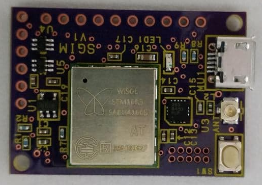
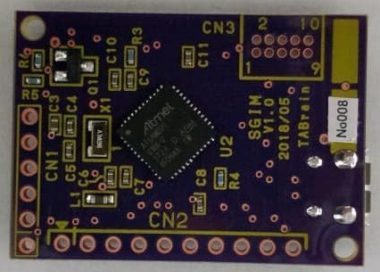
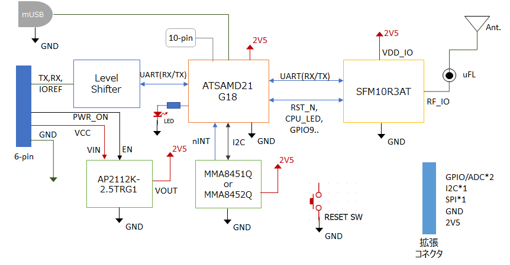

# SGIM(SiGfox IoT Module) Ver1 について

## 概要
**SGIM(エスジム)**は、様々なマイコンを使って、簡単にインターネット接続することができるSDカードサイズの**超小型Sigfox通信モジュール**です。ArduinoやRaspberry Pi、mbed等の様々なマイコンで簡単に利用することができます。また、Arduino Zero互換マイコンチップ、3軸加速度センサ等を搭載しているため、SGIM単体でもArduino IDEを使ってプログラミングが可能です。

Ver1では、コアとなる通信モジュールとしてソンジインダストリアル株式会社(旧 株式会社ワイソル)製の**SFM10R3AT**を採用し、3GIM/4GIMと同じサイズを維持しています。3GIM/4GIMとの違いは下記の通りです：

  * **3Gや4Gサービスの代わりに、LPWA(Sigfox)を利用**
    * 3G/4Gに比べて非常に低消費電力であるため、電池で長時間駆動することができる。
    * 一日に最大140回のアップロード/2回のダウンロード通信が可能で、1回の通信で最大12バイトのデータをアップロード／最大8バイトのデータのダウンロードを行うことができる。日本国内のでSigfox通信サービスはKCCS様が提供している。詳しくは、[KCCS Sigfoxサイト](https://www.kccs-iot.jp/) を参照のこと。
    * Sigfox backendのクラウドサービスを利用することで、アップロードされたデータをe-mailへ通知することや、別のクラウドサービスへ転送することができる。
    * 3GIM/4GIMとピン互換（ただし、機能は非互換）
  * **加速度センサを内蔵**
    * 低消費電力の3軸加速度センサを搭載しており、一定以上の加速度やフリーフォール等をトリガとした処理をSGIM単体で簡単に実現できる。また、省電力に留意したプログラミング・回路構成とすることで、モーション検知を有効にした状態でMCUだけスリープさせることで60uA程度まで消費電流を抑えることも可能。SGIM(V1)では、加速度センサとして**MMA8451Q**を搭載している。

  * **Arduino IDE**を使ってファームウェアの開発が可能
    * Arduino Zero/m0と同じATSAMD21G18A(Cortex-m0+, 32-bit ARM)を搭載しており、出荷時にはArduino用ブートローダが書き込まれているため、Arduino IDEを使って開発することができる。 詳しくは、本ページの下にある [技術情報](README.md#技術情報) を参考にしてください。

## 外観

SGIM(V1)の画像を掲載します。
なお、基板の色やレイアウト・寸法等は、今後変更となる場合がありますのでご注意ください。

### 全体
  * SGIM(V1)本体の表面

  * SGIM(V1)本体の裏面

## 提供する機能

SGIM(V1)は、下記の機能を提供します
  * Sigfox通信を使ったデータのアップロード・ダウンロード
  * 省電力の制御
  * Arduino Zero/m0互換のマイコン機能(Arduino IDEを使ったファームウェア開発)
  * 3軸加速度センサの制御

## SGIMのスペック

| 項目 | 仕様 | 補足 |
| --- | --- | --- |
|外形寸法|幅25mm * 奥行35mm * 高さ7mm|3GIMと同一サイズ。取付穴は2.6mm径(1ヶ所)|
|電源電圧|2.7～6V|レギュレータを介さずに、直接安定した電源(2.2～3.6V)を2V5ピンへ供給することも可能。例えば、ニッケル水素電池2本を直接接続する等|
|消費電流|60uA(sleep時)～70mA(peak時)|利用状況や電波状態、温度環境に依存|
|Sigfoxバンド|RC3(日本向け)||
|マイコンとのインタフェース|UARTを介したコマンド・レスポンス方式||
|添付アンテナ|同梱するポールアンテナまたは小型アンテナ|技適を取得している同梱されたアンテナを必ずご使用ください|
|ロジック電圧|2.5V。ただし、UARTは任意のロジック電圧(外部から供給するIOREF)で利用可能||
|UART|デフォルト設定は9600bps(最大115200bps)/8データビット/パリティなし/1ストップビット|ボーレートは変更可
|添付品(予定)|SGIM本体1個、アンテナ1個、アンテナケーブル1本、20ピンヘッダ1個|ピンヘッダは適当なピン数で折ってご使用ください。|

## ピン配置

### ●6ピンコネクタ
SGIMは下表に示す6つのピンでマイコンと接続します。ピン配置は3GIM/4GIMと同一ですので、ハードウェアとしては差し替えての利用が可能です。ただし、通信機能が3GIM/4GINとSGIMでは大きく異なりますので、ソフトウェア的な互換性はありません。

| ピン番号 | 名称 | 機能など |
| --- | --- | --- |
|1|PWR_ON|VCCから給電している電源のON/OFF制御(開放または0でON、1でOFF)|
|2|RX|UARTインタフェース(RX) **(*1)**|
|3|TX|UARTインタフェース(TX) **(*1)**|
|4|IOREF|PWR_ON,RX,TXのロジック電圧(1.8～5V)|
|5|VCC|電源入力(2.7V以上の外部電源の供給用)|
|6|GND|グラウンド|

　**(*1)**　3GIM/4GIMとの互換性を維持するために設けているUARTポートです。外付けのマイコンを利用しない場合は、内蔵マイコンのUARTの外部端子として利用することができます。このUARTのロジック電圧は、外部からIOREFを与えることで1.8～5Vの範囲で設定できます。超音波距離センサ、赤外線レーザ距離センサ、GPS等、様々なセンサ類を接続できます。

### ●拡張コネクタ
外部にセンサなどのデバイスを接続するためのコネクタ。なお、拡張コネクタの外部信号はすべて2.5Vのロジック電圧です。

| ピン番号 | 名称 | 機能など |
| --- | --- | --- |
|1|A0/DAC|A0(12-bit ADC)またはDAC|
|2|A1|12-bit ADC|
|3|D13||
|4|D10||
|5|SDA|I2CのSDA信号(SGIMボード上の加速度センサでも利用)|
|6|SCL|I2CのSCL信号(同上)|
|7|D11||
|8|D12||
|9|2V5|2.5V電源(最大600mAまで) **(*2)**|
|10|GND|GND|

  **(*2)**　6ピンコネクタのVCCに2.7V以上の外部電源を給電している場合は、2.5Vの電圧がこの端子から供給されます。VCCを使わずに、直接3.3V以下の電源を利用する場合は、この2V5端子に外部電源を給電することもできます（直接2V5に給電する場合は、電圧が3.5Vを絶対に越えないようにしてください）。省電力でSGIMを駆動させる場合のお勧めの方法は、ニッケル水素電池2本を直列に接続して、この2V5端子に給電する方法です。この方法では、SGIM上の電源レギュレータを介さずに給電するため、特にスリープ時の消費電流を低く抑えることが可能となります。

## ブロック構成図
SGIM(V1)の内部ブロック図を下記に示します：

## 技術情報

  * Arduino IDEで利用する方法
    * マイコンボードとして、TABrain製のSGIM(V1)をボードマネージャでインストールして、これを指定してください。
　　　　[SGIM(V1)をArduino IDEで利用する手順](docs/sgim_v1_arduino.md)

  * SGIMを便利に利用するためのライブラリ
    * 上記の利用手順により提供されるライブラリsgim, mma8452q, RTCZeroを利用すると、より簡単にSGIM(V1)を使用することができます。これらの使い方は、各ライブラリのサンプル等を参考にしてみてください。
    * sgimライブラリのサンプルスケッチについては、[sgimライブラリのサンプルスケッチ](docs/sgim_v1_lib_examples.md) を参照ください。

  * Sigfox通信モジュールに搭載している **SFM10R3AT** の[情報](https://www.kccs-iot.jp/solution/product/module7/)

## Sigfoxサービスに関する補足 ====

  * Sigfox回線を開通して、SGIMを利用できるようにする手順について
    * SGIMに搭載されているSigfoxモジュールを使って実際に通信を行うためには、Sigfox回線を開通する必要があります。
    * SGIM(V1.1)には、Sigfoxの回線利用料は含まれていません。そのため、ユーザにてSigfox回線利用を行うための手続きが必要です。具体的な手順は、[Sigfox回線の開通方法](docs/sgim_v1_howto_activate.md) をご参照ください。

  * Sigfox backend(Sigfox Portal)のクラウドサービス側の設定方法について
    * SGIMを使ってSigfoxでLPWA通信を行うには、あらかじめSigfox backendを適切に設定しておく必要があります。
    * Sigfox backendは様々な機能を提供しています。SGIMを使うにあたって最小限の設定方法を [Sigfox backendの設定方法](docs/sgim_v1_howto_setting.md) で説明しています。

## ダウンロード ====

  * [SGIM(V1) 回路図](docs/sgim_v1r9_sch.pdf)

  * SGIM(V1) 用 Arduinoライブラリ **sgim** --「SGIM(V1)をArduino IDEで利用する手順」でインストールされます
    * [SGIMライブラリ](https://github.com/openwireless/3gim)
