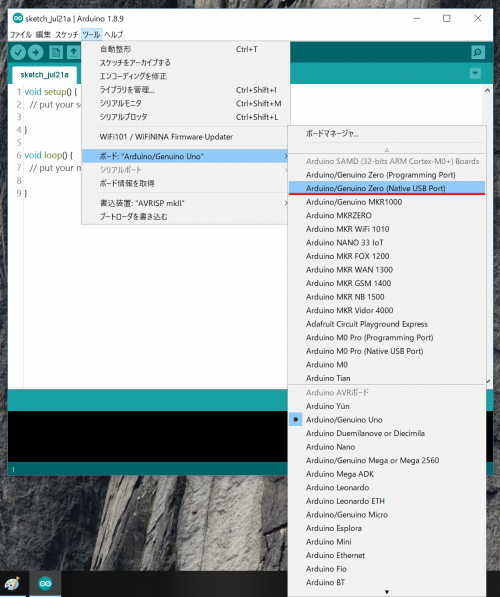

# SGIM(V1)をArduino IDEで利用するための手順
## 概要手順

SGIM(V1)を利用する手順は、下記の通りです。
  - 最新のArduino IDEをインストールする
  - ボードマネージャの追加URLでSGIM(V1)用のURLを追加して、SGIM(V1)ボードをインストールする
  - ボードとして「SGIM(V1)」を選択する
  - 正しくインストール＆追加設定できたかどうかを確認する

## 手順の詳細
具体的な操作手順は下記の通りです。

**1. 最新のArduino IDEをインストールする**
  * Arduinoの [本家サイトのダウンロードページ](https://www.arduino.cc/en/Main/Software) をブラウザで開く

  * Download the Arduino IDE の箇所にある最新のインストーラ（お使いのOSに合ったもの）をダウンロードする
  * インストーラを実行して、Arduino IDEをインストールする
  * インストールしたArduino IDEを起動して、「ツール」メニューの「ボード」を選択し、さらに「ボードマネージャ..」を選択して、ボードの一覧画面を開く

  * 一覧の中にある「Arduino SAMD Boards(32-bits ARM Cortex-M0+) by Arduino」を探して、最新バージョンをインストールする

  * 正しくインストールできたかどうか確認するために、再度、「ツール」メニューの「ボード」を選択し、ボードの一覧リストの中に「Arduino/Genuino Zero(Native USB Port)」があることを確認する

**2. ボードマネージャの追加URLでSGIM(V1)用のURLを追加して、SGIM(V1)ボードをインストールする**
  * Arduino IDEで、「ファイル」メニューの「環境設定」を選択し、環境設定ダイアログを開く

  * 環境設定ダイアログの「追加のボードマネージャのURL」に、下記のURLをコピー＆ペーストして追加する

'''
https://raw.githubusercontent.com/openwireless/boardmanager/master/package_tabrain_index.json
'''

  * 「OK」ボタンを押して、環境設定ダイアログを閉じる
  * 「ツール」メニューの「ボード」を選択し、さらに「ボードマネージャ..」を選択して、ボードの一覧画面を開く
  * 一覧の中にある「LPWA(Cortex-M0+) Board by TABrain」を探す。ない場合は、前の手順に戻り、正しくURLを設定しているかどうかを確認する

  * 「LPWA(Cortex-M0+) Board by TABrain」を選択し、「インストール」ボタンを押して、インストールを行う。
  * エラーなく正しくインストールできたことを確認する（エラーがある場合は、Arduino IDEウィンドウの下部に赤文字でエラーが表示される）

**3. ボードとして「SGIM(V1)」を選択する**
  * 正しくインストールできたかどうか確認するために、再度、「ツール」メニューの「ボード」を選択し、ボードの一覧リストの中に「SGIM(Arduino Zero compatible)」があることを確認して閉じる。

  * 「ツール」メニューの「ボード」を選択し、ボードの一覧リストの中にある「SGIM(Arduino Zero compatible)」を選択する

**4. 正しくインストール＆追加設定できたかどうかを確認する**
  * 「ツール」メニューの「ボード」を選択し、ボードの一覧リストの中にある「SGIM(Arduino Zero compatible)」が選択されていることを確認する
  * 「ファイル」メニューの「スケッチ例」を選択し、「sgim」を選び、さらにサンプルスケッチ「blink_led」を呼び出す

  * Arduino IDEのウィンドウの左上にあるチェックアイコンをクリックするか、「スケッチ」メニューの「検証・コンパイル」を選択し、呼び出したsgimのサンプルスケッチblink_ledをビルドしてみる
  * 正しくインストール＆追加設定が行われていれば、エラーは発生せずにビルドが完了する

以上で、正しくSGIM(V1)を利用する準備が整いました。
